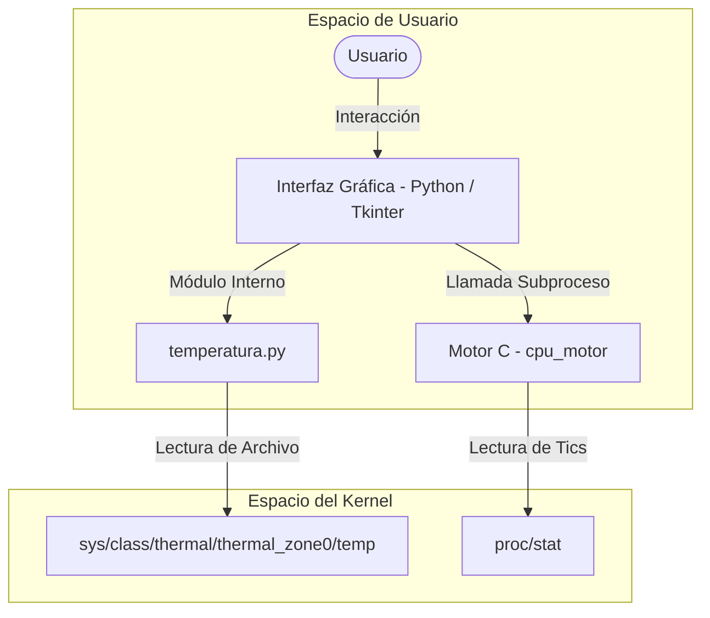

# Monitor de Recursos del Sistema para Linux

Este proyecto consiste en una aplicación de escritorio desarrollada para sistemas operativos basados en Linux. Proporciona una interfaz gráfica de usuario (GUI) que permite monitorizar parámetros clave de hardware, tales como la temperatura del sistema y el porcentaje de uso de la CPU.

La arquitectura de la aplicación combina la facilidad de desarrollo de interfaces con Python y la alta eficiencia en la lectura de bajo nivel mediante un motor compilado en lenguaje C.

---

## Características Principales

*   **Interfaz Gráfica Intuitiva:** Desarrollada con Tkinter, que gestiona el flujo de la aplicación y la interacción con el usuario.
*   **Lectura de Temperatura:** Obtención directa del estado térmico del procesador interactuando con los archivos virtuales del sistema (`/sys/class/thermal`).
*   **Cálculo de Uso de CPU:** Motor escrito en C que calcula el uso de CPU comparando diferencias en los tiempos del sistema a partir de `/proc/stat` con un intervalo de muestreo de 100 ms.
*   **Validación de Ejecutables:** Manejo de excepciones en Python para prevenir fallos si el motor compilado en C no está presente o falla durante la ejecución.

---

## Arquitectura de la Aplicación

La interacción entre la interfaz de usuario en Python y el motor de bajo nivel en C se estructura según el siguiente esquema:



---

## Estructura del Proyecto

| Archivo | Lenguaje | Descripción |
| :--- | :--- | :--- |
| `main.py` | Python | Archivo principal que inicializa la GUI de Tkinter y coordina las llamadas a los sensores. |
| `temperatura.py` | Python | Módulo encargado de leer y formatear la información térmica del procesador. |
| `cpu.c` | C | Código fuente que procesa los "tics" de CPU y calcula el porcentaje de uso actual. |
| `cpu_motor` | Binario | Ejecutable compilado a partir de `cpu.c` que actúa como motor de cálculo de CPU. |
| `logo.png` | Imagen | Imagen utilizada como icono de la ventana principal de la interfaz. |
| `LICENSE` | Texto | Licencia bajo la cual se distribuye el proyecto. |

---

## Requisitos de Ejecución

Para poder compilar y ejecutar este software, su entorno debe cumplir los siguientes requisitos:

*   **Sistema Operativo:** Distribución Linux (Ubuntu, Debian, Fedora o similares) con acceso a `/sys` y `/proc`.
*   **Python:** Versión 3.6 o superior instalada.
*   **Tkinter:** Generalmente incluido en Python. En distribuciones basadas en Debian/Ubuntu, se instala mediante:
    ```bash
    sudo apt-get install python3-tk
    ```
*   **Compilador:** GCC (GNU Compiler Collection) para compilar el código en C.

---

## Compilación e Instalación

### 1. Compilar el Motor de CPU
El código fuente en C debe compilarse para generar el ejecutable que requiere `main.py`:

```bash
gcc -O2 cpu.c -o cpu_motor
```

> [!NOTE]
> El compilador optimizará el código con el flag `-O2` para asegurar que el cálculo sea lo más rápido y preciso posible.

### 2. Ejecutar la Aplicación
Una vez compilado el motor, inicia la aplicación ejecutando el script de Python:

```bash
python3 main.py
```

---

## Detalles Técnicos de Funcionamiento

### Lectura de Temperatura
La temperatura se obtiene mediante la lectura del sensor térmico primario (`thermal_zone0`) de Linux:
$$\text{Temperatura (°C)} = \frac{\text{Valor leído de } \texttt{/sys/class/thermal/thermal\_zone0/temp}}{1000}$$

Si el sensor no está disponible o el sistema no es compatible, la aplicación devolverá el mensaje `"Sensor no encontrado"`.

### Cálculo de CPU
El motor en C lee las estadísticas de `/proc/stat` en dos momentos temporales diferentes separados por un lapso de 100 ms:
1. Se realiza la primera lectura de los tiempos transcurridos en diferentes estados (usuario, kernel, ocioso, etc.).
2. Se realiza una espera controlada de 100 ms (`usleep(100000)`).
3. Se realiza la segunda lectura.
4. Se calcula el porcentaje de uso con la fórmula:
$$\text{Uso CPU (\%)} = 100 \times \frac{\Delta\text{Total} - \Delta\text{Ocioso}}{\Delta\text{Total}}$$
