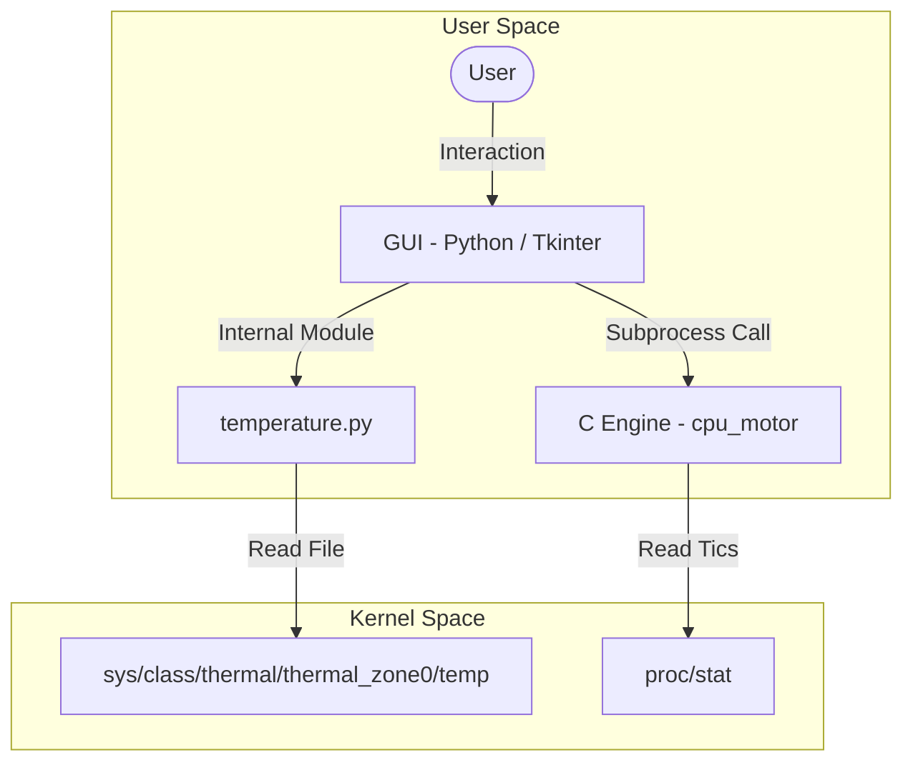

# /usr/bin/sysmon -> Linux System Resource Monitor

> "Executing monitor initialize..."
> [OK] Hardware sensors mapped.
> [OK] CPU stats engine connected.
> [OK] Ready to monitor.

A desktop application designed for Linux operating systems. It provides a graphical user interface (GUI) to monitor key hardware metrics such as CPU usage percentage and system temperature.

The architecture combines a Python-based Tkinter frontend with a high-efficiency C-compiled background engine for low-level system reads.

---

## /usr/bin/features

* **Graphical User Interface:** Built with Tkinter, managing application flow and user interaction.
* **Thermal Monitoring:** Reads CPU core temperature directly from Linux virtual system files (/sys/class/thermal).
* **CPU Usage Calculation:** High-performance engine written in C that measures CPU utilization by parsing /proc/stat with a 100 ms sampling interval.
* **Robust Executable Validation:** Advanced exception handling in Python to prevent application crashes if the compiled C engine is missing or fails.

---

## /etc/architecture

The interaction between the Python GUI and the low-level C engine operates as follows:



---

## /home/raul/projects/sysmon/structure

```text
.
├── .gitignore
├── LICENSE
├── Makefile                 # Build automation and execution
├── README.md                # Project documentation
├── CONTRIBUTING.md          # Guide for developers and contributors
├── requirements.txt         # Operating system requirements
└── src/
    ├── assets/              # Static graphic assets
    │   └── logo.png         # Graphical interface icon
    ├── cpu.c                # C source code (CPU stats engine)
    ├── main.py              # Main Python script (Tkinter GUI)
    └── temperature.py       # Temperature sensor logic in Python
```

| File / Folder | Language | Description |
| :--- | :--- | :--- |
| `Makefile` | Make | Automation script to compile, run, and clean the project. |
| `requirements.txt` | Text | Details system-level dependencies (such as GCC and Tkinter). |
| `CONTRIBUTING.md` | Markdown | Contribution guide detailing coding standards and developer workflow. |
| `src/main.py` | Python | Application entry point that handles the Tkinter GUI and coordinate measurements. |
| `src/temperature.py` | Python | Retrieves temperature readings from the Linux virtual interface (/sys/class/thermal). |
| `src/cpu.c` | C | Source code for the high-performance CPU utilization calculation engine. |
| `src/assets/logo.png` | Image | Main icon used by the graphical user interface. |
| `LICENSE` | Text | Apache License 2.0 license file. |

---

## /usr/bin/install

To simplify setup, a Makefile is provided to automate compilation and execution.

### 1. Compilation
To compile the C engine (src/cpu.c) and output the executable to src/cpu_motor:
```bash
make
```

> [!NOTE]
> The compiler optimizes the binary using the -O2 flag and enables all warnings (-Wall) to ensure safety and peak performance.

### 2. Execution
To build (if needed) and run the application in a single command:
```bash
make run
```

Alternatively, you can run the Python script directly:
```bash
python3 src/main.py
```

### 3. Cleanup
To clean compiled binaries and Python caching directories:
```bash
make clean
```

---

## /var/log/specs

### Temperature Readings
Temperature is calculated by reading the system's primary thermal sensor (thermal_zone0):
$$\text{Temperature (°C)} = \frac{\text{Value from } \texttt{/sys/class/thermal/thermal\_zone0/temp}}{1000}$$

If the sensor is unavailable, the application returns "Sensor not found".

### CPU Calculation
The C-compiled engine reads /proc/stat statistics at two distinct moments separated by a 100 ms interval:
1. Performs the first reading of processor states (user, kernel, idle, etc.).
2. Suspends execution for 100 ms (usleep(100000)).
3. Performs the second reading.
4. Calculates CPU usage with the formula:
$$\text{CPU Usage (\%)} = 100 \times \frac{\Delta\text{Total} - \Delta\text{Idle}}{\Delta\text{Total}}$$

---
"Talk is cheap. Show me the code." - Linus Torvalds
